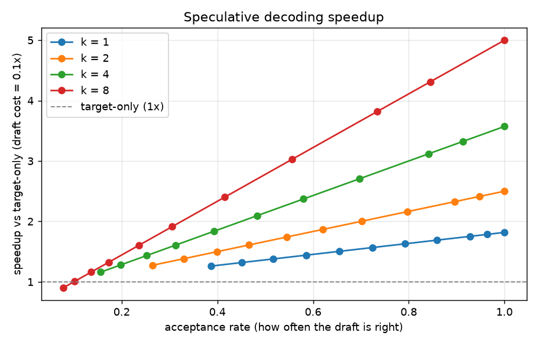
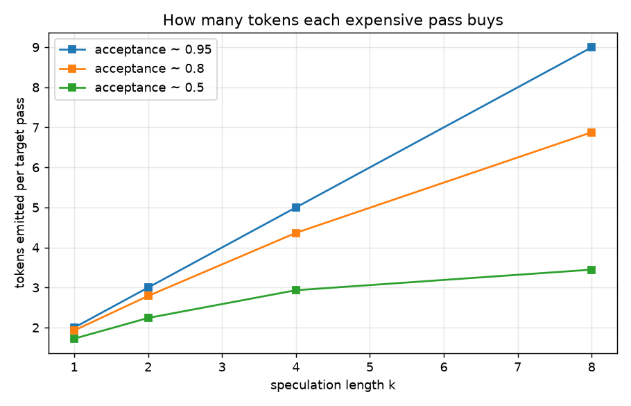

# Benchmarks

Measured on a plain CPU from [`bench/benchmark.py`](bench/benchmark.py) — run it
yourself:

```bash
pip install -e ".[bench]"
python bench/benchmark.py
```

It writes `bench/results/summary.json` and two graphs. All numbers below are
reproduced from that script (vocab 32, 20,000 tokens, seed `20240601`).

## What is measured, and what "speedup" means

Speculative decoding wins by spending fewer **target forward passes** — the
expensive part — to produce the same tokens. We count target passes exactly. A
target-only baseline spends one pass per token; speculative decoding spends one
pass per *step*, and a step emits between 1 and `k+1` tokens.

To turn that into a wall-clock number we state one assumption in the open: a
draft pass costs `draft_cost_ratio` × a target pass (0.1 here — a draft ~10× the
target's speed). Then

```
speedup = (tokens per step) / (1 + k · draft_cost_ratio)
```

We do not report a GPU wall-clock number we did not measure. We report the
algorithmic quantity hardware speedup is proportional to — tokens emitted per
target pass — and the cost assumption that converts it.

## Speedup vs how well the draft tracks the target



The x-axis is the **acceptance rate**: how often the draft's proposal survives
the target's check. Higher is better, and it's the single thing that determines
the win.

### k = 4

| acceptance | tokens / step | tokens / target pass | speedup |
|-----------:|--------------:|---------------------:|--------:|
| 0.16 | 1.62 | 1.62 | 1.16× |
| 0.31 | 2.25 | 2.25 | 1.61× |
| 0.48 | 2.93 | 2.93 | 2.10× |
| 0.70 | 3.79 | 3.79 | 2.71× |
| 0.84 | 4.36 | 4.36 | 3.12× |
| 1.00 | 5.00 | 5.00 | 3.57× |

A perfect draft (acceptance 1.0) emits exactly `k+1 = 5` tokens per target pass —
the theoretical ceiling — and the measured value hits it precisely.

## Choosing k



Bigger `k` speculates further ahead, so each successful pass buys more tokens —
but only if acceptance stays high, and each step pays for `k` draft passes.
The sweep makes the trade-off concrete: at low acceptance, `k = 8` can be
*slower* than target-only once the draft cost is counted; at high acceptance it
reaches a **5× speedup**. There is no free `k` — the right value depends on how
well your draft tracks your target.

## The point that matters most

None of this trades quality for speed. The
[exactness proof](README.md#provably-exact) certifies the emitted tokens are
distributed identically to sampling the target directly — so every speedup in
this file is free of approximation. The benchmark answers "how much faster";
the proof answers "at what cost to correctness", and the answer is *none*.
