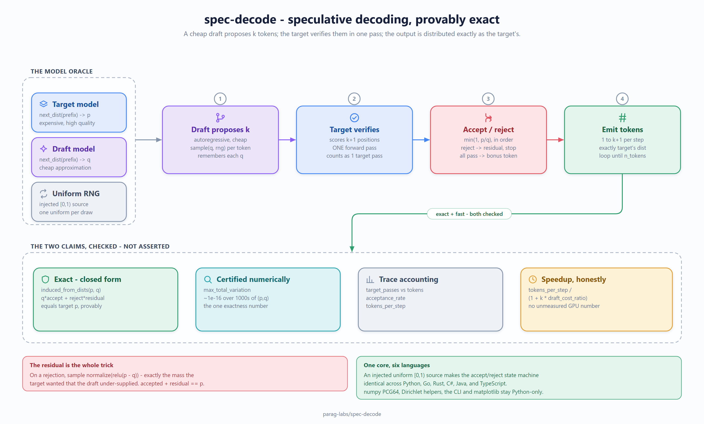

# Design notes



*The whole system on one page: the model oracle, the speculative step, and the two
claims it checks. Vector source: [docs/diagrams/architecture.svg](docs/diagrams/architecture.svg).*

## Problem and goals

Large models are slow to sample because generation is serial: each token needs a
full forward pass, and you can't start token *n+1* until token *n* is done.
**Speculative decoding** breaks the serial dependency without changing what comes
out — a cheap draft model guesses several tokens ahead, the expensive target
verifies them all in one pass, and an accept/reject rule guarantees the result
is *exactly* what the target would have produced alone.

This repo implements that sampler from scratch and — the part that makes it worth
reading — **proves the exactness numerically** and **measures the speedup
honestly**. Goals:

- **Exact, not approximate.** The emitted distribution must equal the target's,
  and that must be a test, not a claim.
- **Deterministic and GPU-free.** Speculative decoding is a property of the
  sampling procedure, so it can be studied with toy distribution oracles — no
  weights, no hardware, fully reproducible.
- **Honest measurement.** Count the expensive operation exactly; state every
  cost assumption in the open.

## Key design decisions

### Model = a next-token distribution oracle

The algorithm only ever asks a model one thing: "given this prefix, what's your
next-token distribution?" So `Model` is just that — `next_dist(tokens) ->
probability vector`. Toy `MarkovModel`s implement it deterministically; a real
transformer implements the same method with a forward pass. The sampler code is
identical either way. This is what lets the whole thing be unit-tested.

### The acceptance rule, and why it's exact

For a proposed token `x` with target probability `p(x)` and draft probability
`q(x)`, accept with probability `min(1, p(x)/q(x))`. On rejection, emit a sample
from the **residual** `normalize(relu(p - q))` and stop the step. The residual is
the whole trick: it is precisely the mass the target wanted that the draft
under-supplied, so accepted-plus-residual reconstructs `p` exactly. If all `k`
proposals are accepted, a bonus token is sampled directly from the target's
look-ahead distribution — a free token, since that pass already happened.

### Proving it instead of asserting it

The first token a step emits is decided entirely at the first proposal position
(the step stops on the first rejection), so its distribution has a closed form:

```
induced(t) = q(t)·accept(t) + (Σ_x q(x)·(1 − accept(x)))·residual(t)
```

`proof.induced_from_dists` computes this, and the test suite asserts it equals
`p` for thousands of random `(p, q)` pairs to floating-point tolerance. Because
every emitted token — accepted, residual, or bonus — is a "first token" relative
to its own prefix, proving this one identity for arbitrary distributions proves
the scheme end to end. The empirical tests then confirm the full generator's
output frequencies match target-only sampling, closing the loop from math to
running code.

### Measuring speedup without lying about hardware

The expensive operation is a target forward pass, so the benchmark counts those
exactly: target-only spends one per token, speculative spends one per step. The
wall-clock speedup is `tokens_per_step / (1 + k·draft_cost_ratio)`, with the
draft's relative cost stated explicitly rather than hidden. We deliberately do
**not** publish a GPU number we didn't run; we publish the algorithmic quantity
that hardware speedup tracks, plus the assumption that converts it.

## Trade-offs I made on purpose

- **Toy models over real weights.** A real model would make a flashier demo but
  would make the exactness *untestable* (you can't enumerate a transformer's
  output distribution in closed form) and would need a GPU in CI. The sampler is
  the contribution; the model is a dependency injected behind one method.
- **First-order Markov target.** Rich enough that the distribution genuinely
  varies with context (so speculation is non-trivial), simple enough to be
  exactly analyzable. A richer toy model wouldn't change the sampler or the
  proof.
- **`draft_cost_ratio` as an open knob** rather than a baked-in constant, so the
  reader can plug in their own draft/target speed ratio.

## Non-goals

- **Not an inference server.** No batching across requests, no KV-cache memory
  management, no networking. It isolates and verifies the *sampling* algorithm.
- **Not a training or modeling project.** The models are fixed oracles; there is
  no learning here.
- **Not tree/Medusa-style speculation.** This is single-draft-sequence
  speculative decoding (Leviathan et al. 2023; Chen et al. 2023). Tree
  speculation is a natural extension behind the same acceptance primitive.

## References

- Leviathan, Kalman, Matias — *Fast Inference from Transformers via Speculative
  Decoding* (2023).
- Chen et al. — *Accelerating Large Language Model Decoding with Speculative
  Sampling* (2023).
