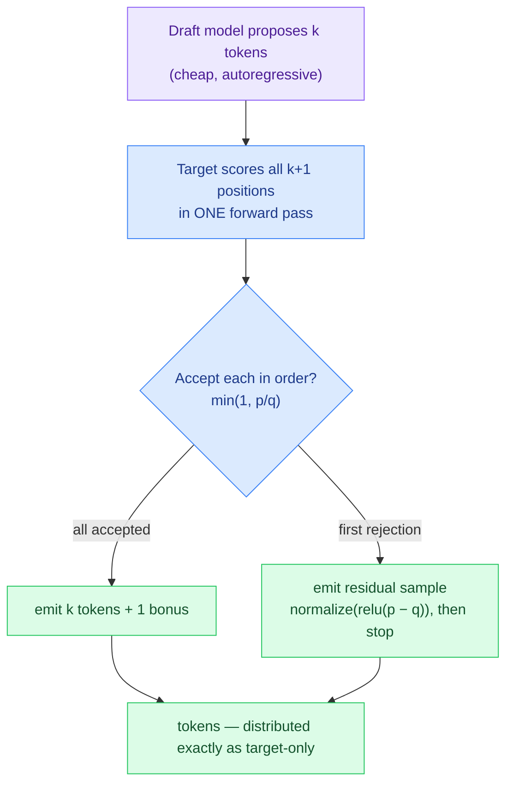

# spec-decode

**Speculative decoding from scratch — with a proof that it's exact.**

A cheap **draft** model proposes several tokens; the expensive **target** model
verifies them all in a single pass; a carefully designed accept/reject rule
guarantees the tokens that come out are distributed *exactly* as if they'd been
sampled from the target one at a time. You get the target's quality at a
fraction of its serial cost — with **no approximation**.

This is the technique behind fast LLM inference in vLLM, llama.cpp, and TensorRT.
Here it's implemented from first principles, the exactness is **certified
numerically** (not just claimed), and the speedup is **measured honestly**.

> It's also the [parag-labs](https://github.com/parag-labs) thesis at the token
> level: *the model proposes; deterministic, verifiable code checks it.* Agents
> propose actions a policy gate verifies; RAG proposes answers a ledger verifies;
> here a draft proposes tokens the target verifies — same idea, all the way down.

```
$ spec-decode verify
max total-variation distance (induced vs target): 2.21e-16
PASS — the emitted distribution equals the target's, exactly.

$ spec-decode run --agreement 0.8 --k 4 --tokens 5000
generated 5000 tokens  (draft agreement 0.8, k=4)
  target passes: 1302   (target-only would need 5000)
  acceptance rate: 0.710
  tokens / target pass: 3.840
  speedup (draft cost 0.1x): 2.74x
```

---

## Why

Sampling from a big model is slow because it's serial — one forward pass per
token, each waiting on the last. Speculative decoding is the standard fix, but
it's easy to get subtly wrong in a way that quietly changes the output
distribution. This repo does the two things that matter: it implements the
sampler cleanly, and it **proves the output is unchanged** — turning "trust me,
it's exact" into an assertion the test suite checks.

## How it works



The **residual** — sampling from the normalized positive part of `p − q` on a
rejection — is the trick that makes it exact. Accepted mass plus residual mass
reconstructs the target distribution precisely.

## Provably exact

The first token a step emits is decided entirely at the first proposal position,
so its distribution has a closed form:

```
induced(t) = q(t)·min(1, p(t)/q(t))  +  (rejection mass)·residual(p, q)(t)
```

`proof.induced_from_dists` computes this, and the tests assert it equals the
target distribution `p` for **thousands of random (p, q) pairs** to
floating-point tolerance (max deviation ~1e-16). Since every emitted token —
accepted, residual, or bonus — is a "first token" relative to its own prefix,
this one identity proves the whole scheme. Empirical tests then confirm the full
generator's output frequencies match target-only sampling. Math → running code,
closed.

## Speedup (measured)


At `k=4`, an 84%-accepted draft gives a **3.12× speedup**; a perfect draft emits
exactly `k+1` tokens per target pass — the ceiling — and the measurement hits it.
Bigger `k` buys more per pass but only if acceptance stays high; at low
acceptance a large `k` can *lose* once the draft's cost is counted. The full
story, the honest cost model, and how to reproduce every number are in
[BENCHMARKS.md](BENCHMARKS.md).

## Use it

```bash
pip install -e ".[dev]"
pytest -q                 # 22 tests, incl. the closed-form exactness proof

spec-decode verify        # certify exactness numerically
spec-decode run  --agreement 0.8 --k 4
spec-decode sweep --k 8   # speedup across acceptance rates
```

As a library, the same core runs against a real model — implement `next_dist`
to call your network's forward pass:

```python
from spec_decode import generate_speculative, random_markov, draft_from_target
import numpy as np

target = random_markov(vocab_size=32, seed=1)
draft  = draft_from_target(target, agreement=0.8, seed=2)
trace  = generate_speculative(target, draft, prefix=[0], n_tokens=200, k=4,
                              rng=np.random.default_rng(0))
print(trace.tokens_per_step, trace.acceptance_rate)
```

## Design decisions

- **A model is just `next_dist(prefix) -> distribution`** — toy Markov oracles in
  the tests, a forward pass in production, identical sampler code.
- **Proved, not asserted** — the exactness theorem is executable and checked over
  thousands of random distributions.
- **Honest speedup** — count the expensive target passes exactly; state the
  draft/target cost ratio in the open; never quote a hardware number that wasn't
  measured.

Trade-offs and non-goals (not a server, not tree speculation) are argued out in
[DESIGN.md](DESIGN.md).

## Layout

```
spec-decode/
├── src/spec_decode/
│   ├── models.py        # Model protocol + deterministic toy models
│   ├── speculative.py   # acceptance sampler, one step, generate, cost accounting
│   ├── proof.py         # closed-form induced distribution (the exactness proof)
│   └── cli.py           # verify / run / sweep
├── tests/               # 22 tests: closed-form exactness, empirical match, mechanics
├── bench/               # benchmark + committed graphs
├── DESIGN.md
└── BENCHMARKS.md
```

## References

Leviathan et al., *Fast Inference from Transformers via Speculative Decoding*
(2023); Chen et al., *Accelerating LLM Decoding with Speculative Sampling*
(2023).

## License

MIT — see [LICENSE](LICENSE).
